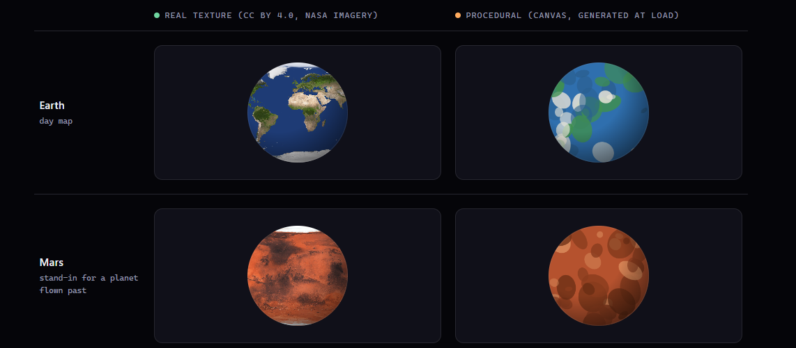

# Process overview

## What I built

This site explains the theory of special relativity by letting the visitor experience its effects, following a story-like structure. The user gets to control the rocket's speed and observe time dilate, with different rates of aging and visual changes to show the characters gap widen. Upon moving to the reunion stage, the side by side reveal shows the difference in aging, with the following section explaining it.

## The moments that mattered

`PLAN.md` - a shell of the project (the story and deliverables), not the complex details was created. I did this so I would have something to reference lightly (if I need to a part of the site, without deep detail) or work deeply when focusing on a specific deliverable. As `CLAUDE.md` loads into every session,  I split the two: universal constraints and tests stayed in `CLAUDE.md`, project shell and step-by-step deliverables stayed in `PLAN.MD`, so I wasn't burning context re-reading deliverable detail on turns that didn't need it (examples of this can be seen in the starting commits of: [`b8de38f`](https://github.com/comp4020-agentic-coding-studio/comp4020-ass1-BilalM004/commit/b8de38fe5d7451dec3a71ca74c66c98ffbe48e0d), [`82aea9c`](https://github.com/comp4020-agentic-coding-studio/comp4020-ass1-BilalM004/commit/82aea9c9774e60b9454a773ecd8877ce5a20d373) - note, `CLAUDE.md` and `PLAN.md` were updated throughout the project). A drawback I realized later into the project occurred when: originally was going for multiple scenes in the animation, but then later, I changed this to a single flight of the rocket, and needed to remember to update `PLAN.md` to reflect this ([`96cf7da`](https://github.com/comp4020-agentic-coding-studio/comp4020-ass1-BilalM004/commit/96cf7da59d8e9f6ef21f4949ee86829b4b7be0ec)). Though kept this structure, this event made me realise the tradeoffs - even when I got Claude to update the file to reflect the changes discussed, I still needed to remember to update (and review) it.

After going through the narrative once, after restarting the story, the animation would drop out. I had found encountered animation related issues earlier too, and found myself burning tokens making Claude aware of this. Having to find these bugs manually, I decided to add a test into the harness, giving me assurance that such errors would be caught, and less time, and tokens, would be burnt when resolving such issues. I began by mapping out the space that would trigger the bugs, experimenting with the site. Finding it only occurred after a full initial run, I notified Claude, to reason and find the underlying issue, and then form a test for it, so if animation related work was done, a deterministic test could check it behaved as expected ([`15826f8`](https://github.com/comp4020-agentic-coding-studio/comp4020-ass1-BilalM004/commit/15826f8f98ba567a460397da51fbd1246abd9491)), which it checked worked as intended by intentionally causing animation errors.

Code generation being cheap, I implemented and scrap ideas with minimal cost. During the animation sequence, I discussed with Claude the textures to use on the planets and the sun. I got given the option of pixel-art, or using real imagery. I needed to decide which to use. Instead of going through the entire process, and then deciding to switch later down the line, taking up additional time and budget, I asked Claude to generate what both would look like side by side (without animations keep it cheap on tokens). Claude returned a HTML file, to help me visualize better (as seen below - [here](docs/texture-comparison.html)). The HTML file was cheap and I was able clearly visualize the choices I had. I knew this was the right decision as it gave me more confidence in the final output and alignment with my ideas.

